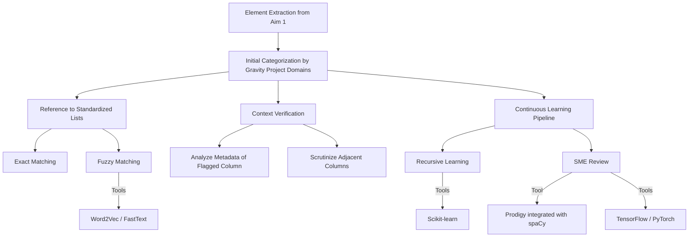

1. To generate with chatGPT:

Behave as "MermaidGPT"; for every query the user submits, you are going to create an example of what Mermaid format for the inputted text looks like. Format it as code. Example map for an example topic: 
flowchart TD 
A[Christmas] →|Get money| B(Go shopping) 
B → C{Let me think} 
C →|One| D[Laptop] 
C →|Two| E[iPhone] 
C →|Three| F[fa:fa-car Car] 
Start by asking questions first.

2. please take this below workflow that i have summarized in this paragraph: 

Mapping Data Elements to Interoperability Standards: Our mapping process commences with Element Extraction, which is the outcome of Aim 1. From Aim 1, we extract potential SDoH elements from columns or metadata fields within textual documents. For example, columns labeled 'food' or those containing the term 'food insecurity' are identified and processed for further categorization. Post extraction, the Initial Categorization step begins. Here, elements are clustered into one of the specific domains as defined by the Gravity project. These domains include: Food insecurity, housing instability, homelessness, inadequate housing, transportation insecurity, financial insecurity, material hardship, employment status, educational attainment, veteran status, stress, social connection, intimate partner violence, elder abuse, health literacy, medical cost burden, and health insurance coverage status. This preliminary categorization serves as the foundation for the subsequent mapping phases.To automate and systematize this mapping, a Reference to Standardized Lists is utilized. This list comprises the various SDoH terms alongside their corresponding standardized codes, and is maintained by the Gravity Project. Extracted elements are then compared with this list to establish an initial mapping. Given that direct mappings might not always be feasible, we will deploy two approaches. First,  Exact Matching: through this, a direct correlation between the extracted elements and terms in the standardized list is sought. In cases where exact matches are elusive, we turn to Fuzzy Matching. This technique involves using algorithms to discern near matches or terms that are semantically related. Tools like Word2Vec or FastText will be assessed to assist in finding terms with similar meanings, especially if the text does not use standard phrasing. Adding a layer of precision, we integrate Context Verification. By examining the surrounding metadata of the flagged column or field, we can validate the context of the extracted element, ensuring its alignment with the broader dataset context. For columns or fields flagged as potential SDoH elements, we'll analyze any provided descriptions or annotations tied to the column. Such metadata often offers a brief synopsis of the column's purpose, the type of data it contains, or its relationship to other columns. By assessing this metadata, we can establish a clearer understanding of the column's true intent and content, ensuring that, for instance, a column labeled 'food' genuinely pertains to food insecurity and not an unrelated context like 'food preferences' or 'food allergies'. Additionally, the adjacent columns or fields in the dataset are scrutinized. The surrounding columns can help contextualize our identified SDoH element by providing ancillary information. For example, a column labeled 'food insecurity' might be situated next to columns addressing financial stability or housing. The coexistence of these related columns can serve as a confirmation of the context, further bolstering the accuracy of our element extraction. Lastly, we will have an exploratory portion of this process focused around a continuous learning pipeline that utilizes recursive learning combined with subject matter expert (SME) review. Recursive learning, a type of feedback loop, allows models to improve their predictions based on iterative cycles of training and feedback. For our context, every time the model maps a potential SDoH element to a specific HL7/FHIR/GRAVITY standard, this mapping can be stored and reinforced in subsequent predictions. Scikit-learn offers tools to retrain models based on new data points, enabling this recursive mechanism. At periodic intervals, a batch of mapped SDoH elements will be presented to an SME for review. Their feedback, consisting of confirmed mappings or corrections, will be fed back into the system. This human-in-the-loop approach ensures that the model's predictions align with expert opinion and clinical relevance. Prodigy is an annotation tool integrated with the spaCy library. It allows for efficient expert review of model predictions and easy feedback incorporation. After SME validation, the model will adjust its internal mapping logic based on the feedback. This ensures that the model not only corrects its current shortcomings but also becomes more adept at handling similar cases in the future. TensorFlow or PyTorch can be used to update neural network-based models with the latest feedback. The model's weights are adjusted to reflect the SME's inputs, refining its mapping capabilities.

3. which should then generate some mermaid code:

4. Which then can copied into a online tool like https://mermaid.live/

